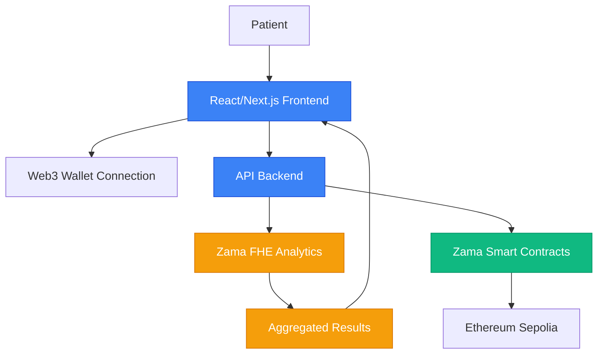

# Apu Sensible Data Guardian

A decentralized platform for managing sensitive healthcare data while enabling privacy-preserving research for non-profit organizations. Combines client-side encryption, decentralized storage, and Fully Homomorphic Encryption (FHE) to protect patient records while allowing statistical analysis.

  

## Features

- **End-to-End Encryption**: Patient data encrypted client-side before transmissione
- **Privacy-Preserving Analytics**: FHE enables computation on encrypted data without exposure
- **Smart Contract Access Control**: Transparent permission management via Zama contracts
- **Regulatory Compliance**: Built-in audit trails and compliance support

## Architecture

### Data Flow
1. **Data Submission**: Patients encrypt records client-side before upload
2. **Private Computation**: FHE performs calculations without decryption
3. **Insight Generation**: Aggregated, anonymized results delivered to authorized parties
4. **Access Control**: Smart contracts enforce granular permissions with audit trails

### Technical Architecture

**Components:**
- **Frontend**: React/Next.js with Web3 wallet connection
- **Backend**: Solidity / Typescript
- **Smart Contracts**: Ethereum Sepolia using Zama confidential contracts
- **Storage**: FHE smart contracts for encrypted data
- **Computation**: Zama FHE for off-chain analytics

## Key Benefits

- **For Organizations**: Risk reduction, compliance support, operational insights
- **For Researchers**: Ethical research on larger datasets with built-in privacy
- **For Patients**: Data sovereignty, enhanced privacy, improved care coordination

## MVP Capabilities

- **Health Record Storage**: Secure, encrypted patient record management
- **Statistical Research**: Privacy-preserving analytics on encrypted datasets
- **Access Control**: Smart contract-based permission management
- **Compliance Support**: Audit trails and regulatory compliance features

## Security & Compliance

- **Cryptographic Standards**: AES-256-GCM, SHA-256, ECDSA
- **Regulatory Support**: HIPAA, GDPR, FDA compliance features
- **Audit Capabilities**: Complete on-chain transaction history

## Documentation

- **[GitBook](https://apuhealth.gitbook.io/apu)**: Detailed integration guides

## Contributing

Submit PRs following security standards. All contributions require code review and security assessment. Report security issues to security@apuhealth.io.

## License

MIT License with additional security requirements. **Important**: Ensure regulatory compliance before deployment.
